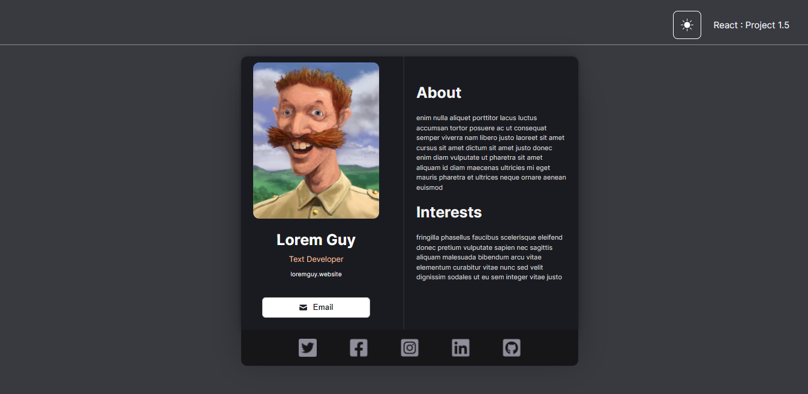
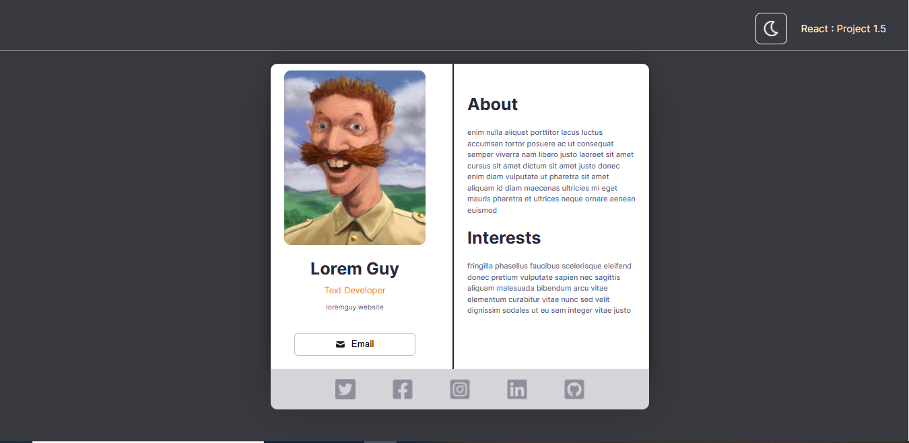

# 👰‍ contact-card
This repository showcases my project of building a contact card build using the React.js framework.

## :computer: Tools employed
* React.js
* HTML
* CSS
* JavaScript

## :bulb: Key Highlights
* This contact card project introduced me to the concept of React's functional components. 
* Furthermore, it offered a good practice of fundamental HTML and CSS.
* I added a feature using React hooks that enables switching between light and dark mode.

## 📸 ScreenCaptures

| | |
| :------------------------------ | ------------------------:|
